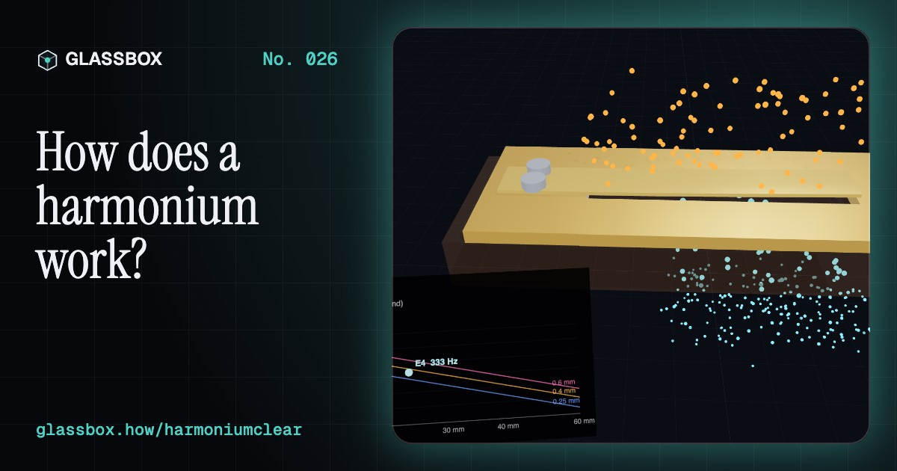
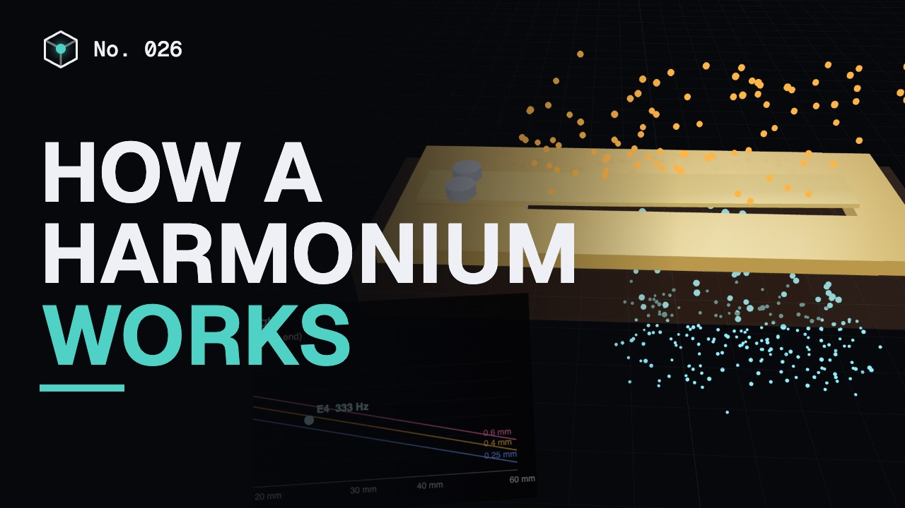
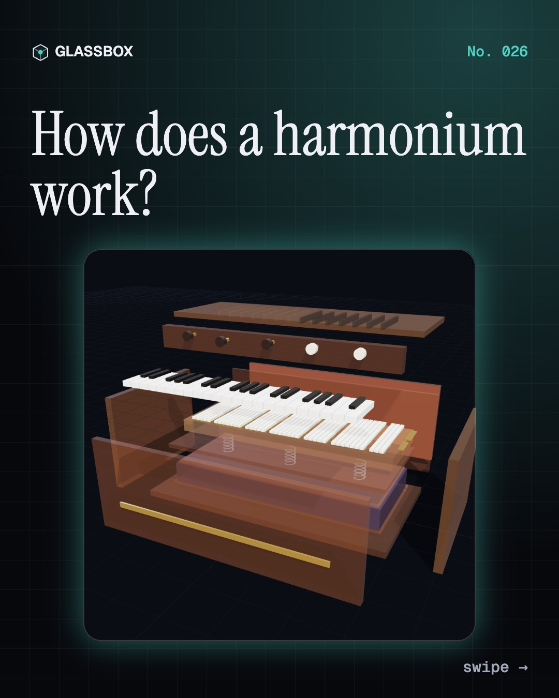
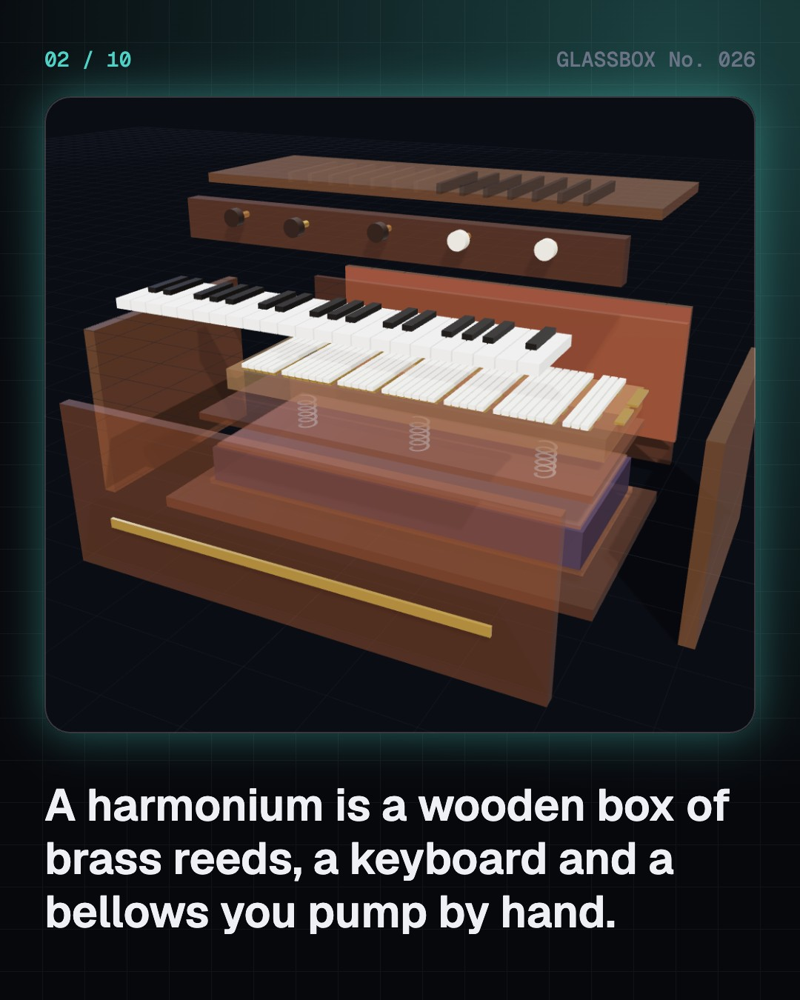
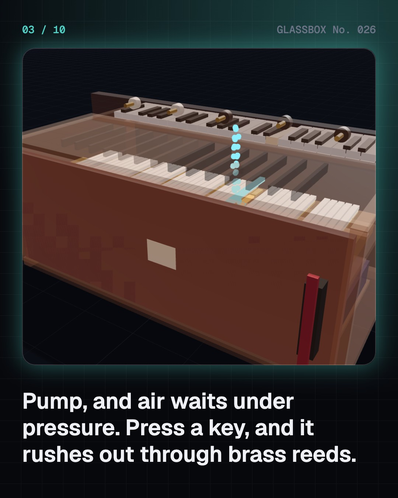
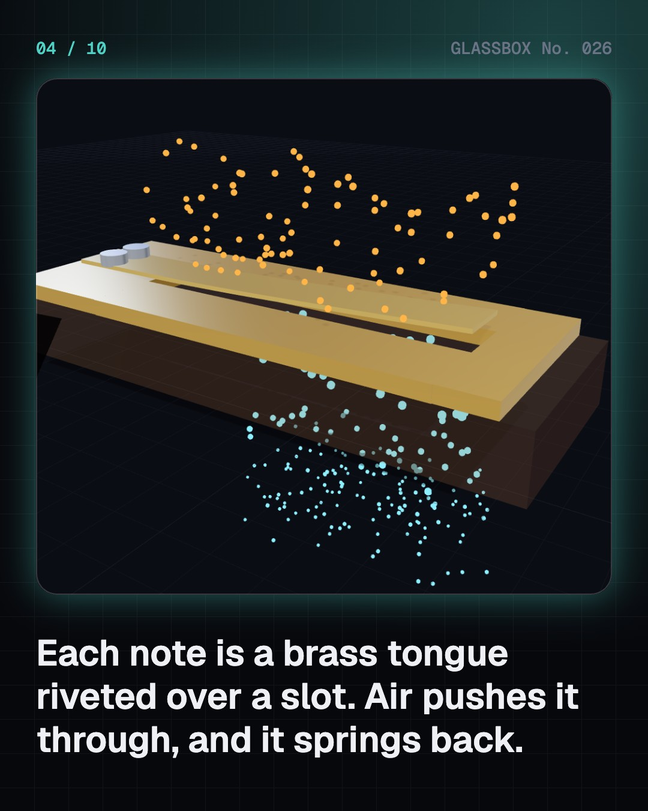

<!-- glassbox:start -->
<!-- Generated from glassbox.json by the Glassbox hub (npm run readme -- harmoniumclear). Edit glassbox.json, not this block. -->
<p align="center"><a href="https://glassbox-production-fd52.up.railway.app/e/harmoniumclear/"></a></p>

<h1 align="center">HarmoniumClear</h1>

<p align="center"><b>How does a harmonium work?</b><br>Every note on a harmonium is a thin brass tongue buzzing through a slot, fed by air you pump with one hand. Take one apart in 3D, scrape a reed to tune it, pull the stops, hear why its fixed notes got it banned from All India Radio, and play it with your keyboard.</p>

<p align="center"><a href="https://glassbox-production-fd52.up.railway.app/harmoniumclear/"><b>▶ Play with it</b></a> &nbsp;·&nbsp; <a href="https://glassbox-production-fd52.up.railway.app/e/harmoniumclear/">Read the 60-second explainer</a> &nbsp;·&nbsp; <a href="https://glassbox-production-fd52.up.railway.app/harmoniumclear/glassbox/reel.mp4">Watch the 40-second video</a></p>

<p align="center">
  <a href="https://glassbox-production-fd52.up.railway.app/e/harmoniumclear/"></a>
  <a href="https://glassbox-production-fd52.up.railway.app/e/harmoniumclear/"></a>
  <a href="LICENSE"></a>
  <a href="LICENSE-CONTENT.md"></a>
  <a href="#privacy"></a>
</p>

## In 60 seconds

1. **A box of reeds and a bellows.** An Indian harmonium is a wooden box with a keyboard on top and a hinged bellows at the back. Inside sit a spring-loaded reservoir of air, a reed board with rows of brass reeds in little cells, a padded valve (a pallet) under every key, and stop knobs that choose which rows get air.
2. **A brass tongue that chops the air.** Each note is a free reed: a thin brass tongue riveted over a slot. Air pushes it through, it springs back, and every swing lets out a puff. It swings at its natural frequency, f = 0.56·(t/L²)·√(E/12ρ), so a longer tongue is much lower. Makers tune by scraping: the tip to go up, the root to go down.
3. **Pump, store, squeeze.** Your hand pushes air through a one-way valve into a reservoir held shut by springs. The springs keep the wind at about 0.5 to 1.5 kPa, only 1% above the room's pressure. Every open reed lets out about 0.07 L/s, so big chords drain it fast. Pump harder and it plays louder: that is its only volume control.
4. **Pull a stop, add a voice.** Each stop opens a bank of reeds: bass an octave down, male at the key's pitch, female an octave up. Their harmonics stack and beat gently, and a musette bank tuned a few cents sharp beats a few times a second. Drone stops hold Sa and Pa without any key.
5. **Fixed notes in a sliding music.** The reeds are tuned once, usually to equal temperament: Ga is 400 cents above Sa, while the pure 5/4 Ga that singers lean to is 386. Held together they beat about ten times a second. A scale changer slides the keyboard over the reeds to change key without changing fingers.
6. **From church organ to every stage in India.** Missionaries brought pedal reed organs; in Calcutta, Dwarkanath Ghose is widely credited with the hand-pumped floor harmonium by 1875. It spread to bhajan, kirtan, qawwali, theatre and film. All India Radio banned it from 1 March 1940, and partly lifted the ban in 1971. Masters like Tulsidas Borkar made it a solo voice.

## Words worth knowing

| Term | Meaning |
|---|---|
| **Free reed** | A springy tongue that swings freely through a slot, chopping airflow into puffs. Used in harmoniums, accordions, harmonicas and the sheng. |
| **Natural frequency** | The rate an object vibrates at by itself, set by its stiffness and its mass. |
| **Cantilever** | A beam fixed at one end and free at the other, like a diving board or a reed tongue. |
| **Reservoir** | The inner, spring-loaded bellows that stores air and keeps the wind pressure steady. |
| **Pallet** | The padded valve under each key that lets air through that key's reeds. |
| **Stop** | A knob that opens or closes the air to one bank of reeds, or to a drone reed. |
| **Beats** | The slow swell and fade when two nearly equal frequencies sound together. The beat rate is their difference. |
| **Equal temperament** | Tuning where every semitone is exactly 100 cents, so every key works but only octaves are pure. |
| **Shruti** | A fine step of pitch in Indian music, finer than a semitone; tradition counts 22 in an octave. |

## A short history

**More than 3,000 years from a Chinese mouth organ with tiny bamboo reeds, through the parlours and churches of Europe, to the hand-pumped box that sings with India's temples, gurdwaras, qawwalis and film songs.**

- **1300 BCE** · The sheng: the first free reeds (Musicians of Shang dynasty China, Northern China)
- **1780** · A machine that says its vowels (Christian Gottlieb Kratzenstein, St Petersburg, Russia)
- **1840** · The harmonium gets its name (Alexandre Debain, Paris, France)
- **1863** · Scientists tune harmoniums to pure intervals (Hermann von Helmholtz; Robert Bosanquet, Heidelberg, Germany, and London, England)
- **1875** · The hand-pumped harmonium (Dwarkanath Ghose (Dwarkin & Son), Lower Chitpur Road, Kolkata (Calcutta), India)
- **1912** · The bane of Indian music (Rabindranath Tagore, Bengal, India)
- **1940** · All India Radio bans the harmonium (Lionel Fielden, Controller of Broadcasting, after a campaign by John Foulds, Delhi, India)
- **1971** · The ban is partly lifted (All India Radio and the Sangeet Natak Akademi, New Delhi, India)

The full story, with 29 moments, charts, people and 58 sources: [glassbox.how/e/harmoniumclear/history](https://glassbox-production-fd52.up.railway.app/e/harmoniumclear/history/). The data lives in [`history.json`](history.json).

## Video and slides

Made with the Glassbox studio from this box's storyboard (`window.glassbox.director`). Free to reuse under CC BY 4.0.

<a href="https://glassbox-production-fd52.up.railway.app/harmoniumclear/glassbox/video.mp4"></a>

<p><a href="glassbox/slide-1.jpg"></a> <a href="glassbox/slide-2.jpg"></a> <a href="glassbox/slide-3.jpg"></a> <a href="glassbox/slide-4.jpg"></a></p>

| File | What | Size |
|---|---|---|
| [`glassbox/reel.mp4`](https://glassbox-production-fd52.up.railway.app/harmoniumclear/glassbox/reel.mp4) | Reel / Short, with captions and soundtrack | 1080×1920 |
| [`glassbox/video.mp4`](https://glassbox-production-fd52.up.railway.app/harmoniumclear/glassbox/video.mp4) | YouTube video, with captions and soundtrack | 1920×1080 |
| `glassbox/slide-1…10.jpg` | Instagram carousel | 1080×1350 |
| `glassbox/thumb.jpg` | YouTube thumbnail | 1280×720 |
| `glassbox/cover.jpg` | Share card and repo social preview | 1200×630 |
| [`glassbox/history-reel.mp4`](https://glassbox-production-fd52.up.railway.app/harmoniumclear/glassbox/history-reel.mp4) | “History in 10 moments” Reel / Short | 1080×1920 |
| `glassbox/history-slide-*.jpg` | History carousel | 1080×1350 |
| `glassbox/post.json` | Post copy and schedule used by the publish kit | |

## Privacy

This box has no accounts and no ads, and it ships its own fonts and libraries. When you run it yourself it sends nothing anywhere. On glassbox.how, the site's `/bar.js` also loads Glassbox's analytics: **Google Analytics** to count visits (it asks first in the EU, UK and Switzerland, and stays off when your browser sends Global Privacy Control or Do Not Track) and **ClickTrust** to detect bots.

It remembers a few things **in your own browser only**, and never sends them anywhere:

| Browser storage key | What it holds |
|---|---|
| `harmoniumclear.v1` | Which chapters you have opened, your best quiz scores, and sound on or off. |

Exactly what each one sees is at [glassbox.how/privacy](https://glassbox-production-fd52.up.railway.app/privacy/).

## Licences

- **Code:** [MIT](LICENSE). Use it, change it, ship it.
- **Explanations, text, images and videos** (`glassbox.json`, `glassbox/`): [CC BY 4.0](LICENSE-CONTENT.md). Credit “Glassbox, glassbox.how/e/harmoniumclear”.
- **Third-party parts** keep their own licences: [three.js](https://threejs.org) (MIT), [Geist, Instrument Serif](https://openfontlicense.org) (SIL OFL 1.1).
- The Glassbox name and logo aren't covered by either licence. See the [terms](https://glassbox-production-fd52.up.railway.app/terms/).

Found a mistake? [Open an issue](https://github.com/bdeeps/harmoniumclear/issues). Corrections happen in public.
<!-- glassbox:end -->

## Run it

It's plain HTML, CSS and JavaScript. No build step and no dependencies. Run locally, it contacts no other website.

```bash
python3 -m http.server 8000
```

Three.js and the fonts ship in `vendor/` and `fonts/`, so it also works offline.

Then open http://localhost:8000.

## How it's built

| File | What |
|---|---|
| `index.html`, `css/app.css` | The page and its styles |
| `js/app.js`, `js/stage.js`, `js/ui.js`, `js/kit.js` | The shared Glassbox 3D engine: chapters, 3D stage, controls, quiz, video director |
| `js/harmonium.js` | The shared parts: free-reed beam physics, the bellows and reservoir wind model, tuning maths, the playing engine, the WebAudio free-reed voice, keyboard input, the 3D harmonium and player, and the chart boards |
| `js/chapters/*.js` | One file per chapter: the 3D model, controls, text, key terms, quiz and video scenes |
| `glassbox.json` | Title, question, explainer beats, key terms, browser storage and credits shown on glassbox.how |
| `reel` in each chapter | The storyboard the Glassbox studio records into short videos |
| `glassbox/` | The published video, slides, thumbnail and post copy |
| `fonts/`, `vendor/three/` | Self-hosted Geist and Instrument Serif (SIL OFL 1.1) and three.js (MIT) |
